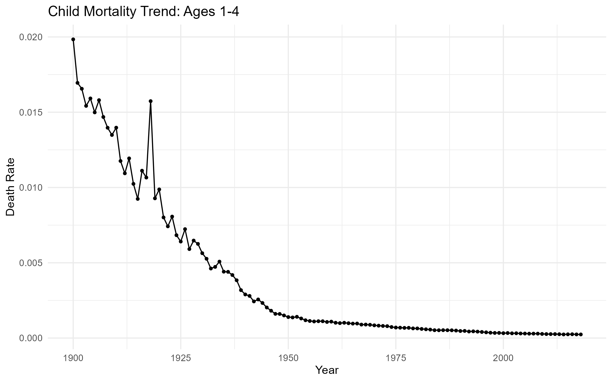
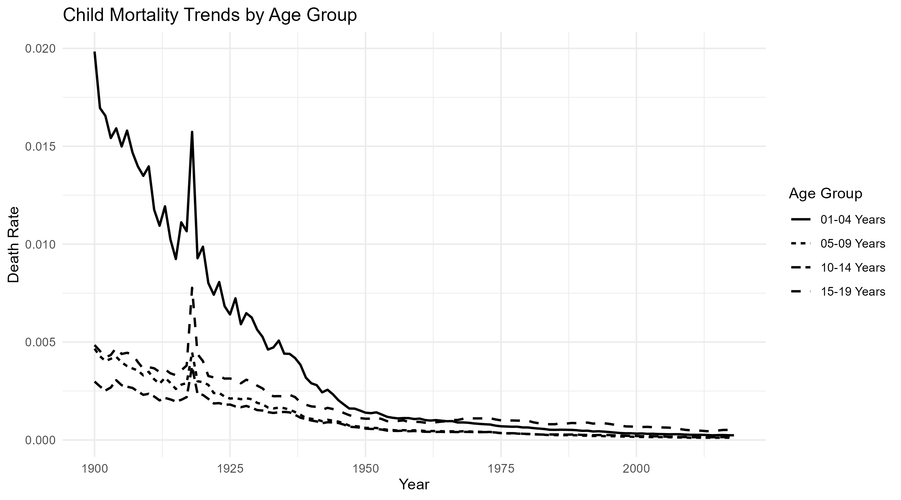
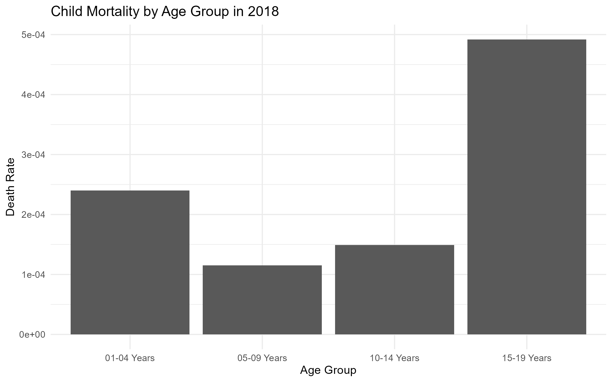
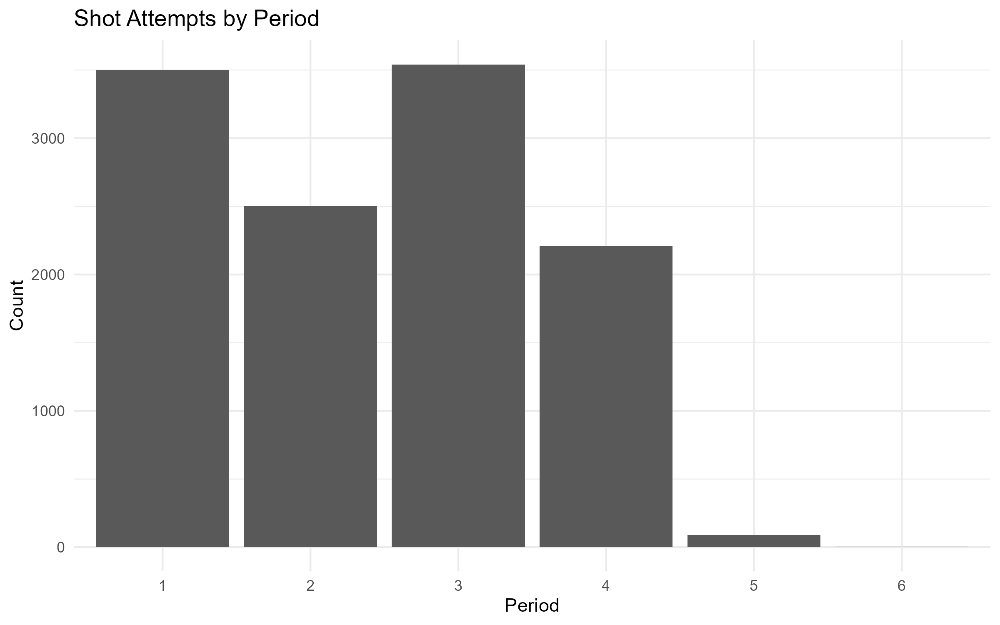

# Child Mortality Analytics (R)

## 📊 Overview
This project analyzes historical child mortality rates using R.  
The goal is to explore trends across different age groups and visualize changes over time using real-world datasets.

---

## 📁 Data Sources
- Excel dataset: child mortality rates by age group (1900–recent)
- JSON dataset: NBA shot data (used for additional visualization practice)

---

## 🛠️ Tools & Technologies
- R
- tidyverse (data manipulation)
- ggplot2 (data visualization)
- readxl (Excel data)
- RJSONIO (JSON data)

---

## 📈 Visualizations









---

## 🔍 Key Insights
- Child mortality rates have significantly declined over time.
- Younger age groups historically had higher mortality rates.
- Trends show consistent improvement across all age groups.
- Additional dataset demonstrates ability to work with JSON and different data formats.

---

## ▶️ How to Run

1. Clone the repository:
```bash
git clone https://github.com/your-username/child-mortality-analytics-r.git
